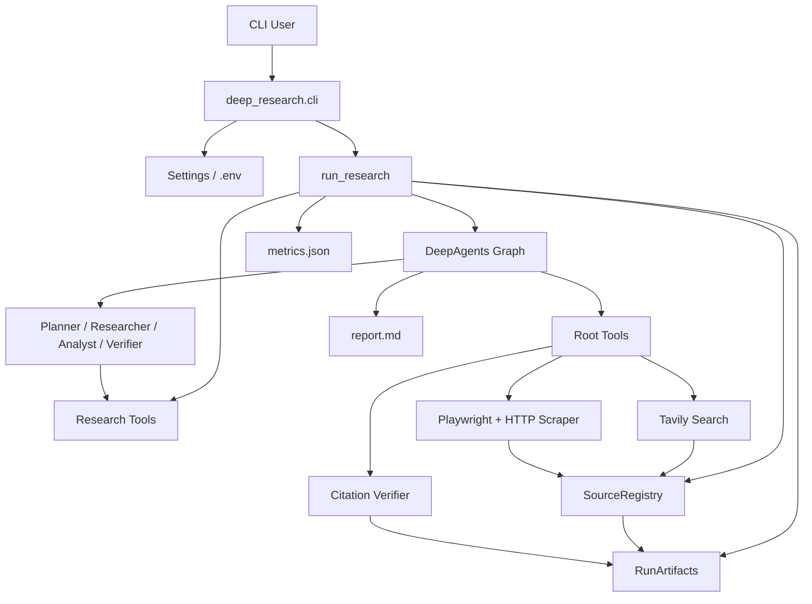
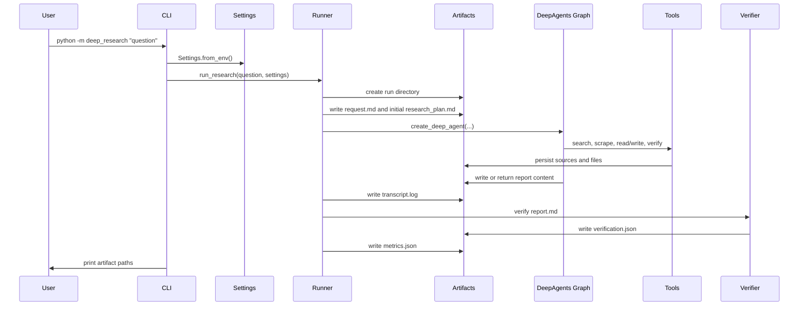

# Deep Research Agent Architecture

## 1. Purpose

Deep Research Agent is a public-web research system designed to produce source-backed research reports with reproducible artifacts, visible progress, deterministic citation verification, and benchmark evaluation support.

The system is built around four principles:

- **Evidence first**: search results are only candidates; relied-on sources must be scraped before they can pass verification.
- **Reproducibility**: every run gets its own artifact directory with the request, sources, report, transcript, metrics, and verification output.
- **Provider flexibility**: model execution can use Google Gemini or Groq through LangChain model strings.
- **Measurability**: reports are checked by deterministic citation validation and can be scored through a benchmark harness.

The current scope is public-web research. It does not yet support private browsing sessions, authenticated sources, local PDFs, or uploaded corpora.

## 2. High-Level System



The user starts the system with `python -m deep_research "question"`. The CLI loads configuration, creates a run directory, builds tools and subagents, streams DeepAgents updates, finalizes artifacts, and prints the generated paths.

## 3. Runtime Entry Points

### Primary CLI

`deep_research/cli.py` is the main user entry point.

Primary command:

```powershell
python -m deep_research "research question"
```

Important options:

- `--provider auto|google|groq`: selects model provider. `auto` uses Groq when `GROQ_API_KEY` exists, otherwise Google.
- `--model`: overrides the main model. Short names are prefixed by the selected provider.
- `--fast-model`: overrides the subagent and judge model.
- `--mode fast|balanced|max_quality`: controls default source and repair budgets.
- `--max-sources`: caps results per search call.
- `--max-rounds`: caps verifier repair rounds.
- `--scrape-char-limit`: controls how much scraped text is saved per source.
- `--progress live|raw|quiet`: controls console progress display.

### Compatibility Wrappers

`agent.py` and `deep_research_agent.py` are thin compatibility wrappers around the canonical CLI. They exist so older commands still route into the package entry point.

### Evaluation Commands

`deep_research/eval.py` runs benchmark datasets:

```powershell
python -m deep_research.eval --dataset benchmarks/seed.jsonl --out eval_runs --limit 1
```

`deep_research/eval_report.py` summarizes a benchmark result file:

```powershell
python -m deep_research.eval_report eval_runs/<run>/results.jsonl
```

## 4. Configuration

Configuration lives in `deep_research/settings.py`.

`Settings.from_env()` loads `.env` from the project root and validates required keys.

Required keys:

- `TAVILY_API_KEY`: required for public-web search.
- `GROQ_API_KEY`: required when provider resolves to `groq`.
- `GOOGLE_API_KEY`: required when provider resolves to `google`.

Optional keys:

- `DEEP_RESEARCH_PROVIDER`
- `DEEP_RESEARCH_MODEL`
- `DEEP_RESEARCH_FAST_MODEL`
- `DEEP_RESEARCH_SCRAPE_CHAR_LIMIT`
- `DEEP_RESEARCH_TOOL_EXCERPT_CHAR_LIMIT`

Provider defaults:

| Provider | Main model | Fast model |
| --- | --- | --- |
| `groq` | `groq:openai/gpt-oss-20b` | `groq:openai/gpt-oss-20b` |
| `google` | `google_genai:gemini-2.5-flash` | `google_genai:gemini-2.5-flash` |

Groq is preferred automatically when a Groq key is present because the project was adapted to avoid Gemini free-tier quota exhaustion. The default Groq model is intentionally the 20B tool-call-capable model because larger Groq models can exceed on-demand token-per-minute limits in multi-step agent flows.

Mode defaults:

| Mode | Default max sources | Default repair rounds |
| --- | ---: | ---: |
| `fast` | 6 | 1 |
| `balanced` | 12 | 2 |
| `max_quality` | 24 | 3 |

Provider-specific scraping defaults:

| Provider | Saved scrape chars | Tool-return excerpt chars |
| --- | ---: | ---: |
| `groq` | 6,000 | 1,500 |
| `google` | 15,000 | 2,500 |

The scraper saves more text to disk than it returns to the model. This keeps the run reproducible without overloading low-TPM providers with huge tool responses.

## 5. Package Layout

```text
deep_research/
  __main__.py             Module entry point for `python -m deep_research`
  cli.py                  CLI parsing, settings construction, final status output
  settings.py             Env loading, provider/model resolution, budget defaults
  agent.py                DeepAgents graph creation and run lifecycle
  prompts.py              Root orchestrator prompt
  subagents.py            YAML subagent loading and tool binding
  tools.py                Search, scrape, file, verifier, and analyst tools
  scraper.py              Playwright scraper with HTTP fallback
  source_registry.py      Source dedupe, source IDs, source persistence
  artifacts.py            Run directory creation and path safety
  verifier.py             Deterministic citation/source verifier
  models.py               SourceRecord, Metrics, VerificationResult dataclasses
  urls.py                 URL canonicalization
  progress.py             Concise live progress rendering
  eval.py                 Benchmark execution harness
  eval_report.py          Benchmark result summarizer
```

Repository-level support files:

- `subagents.yaml`: planner, researcher, analyst, and verifier subagent definitions.
- `skills/comprehensive-report/SKILL.md`: workflow instructions for comprehensive reports.
- `benchmarks/seed.jsonl`: seed benchmark dataset.
- `tests/`: unit and mocked integration tests.
- `.env.example`: expected environment variables.
- `pyproject.toml`: package metadata and dependencies.

## 6. Core Run Lifecycle

The main lifecycle is implemented in `run_research()` in `deep_research/agent.py`.



Detailed steps:

1. The CLI configures UTF-8 console output to avoid Windows encoding crashes.
2. `Settings.from_env()` loads `.env`, resolves provider/model defaults, and validates keys.
3. `RunArtifacts.create()` creates `runs/<timestamp-slug>/`.
4. `request.md`, an initial `research_plan.md`, empty `sources.jsonl`, `findings/`, and `source_docs/` are created.
5. A `SourceRegistry` is attached to the run.
6. A `ToolContext` is created with settings, artifacts, registry, Tavily client, scraper, Python REPL, metrics, and progress callback.
7. `create_deep_agent()` builds the root DeepAgents graph with root tools and subagents.
8. The graph streams updates. In `live` progress mode these are summarized into concise progress lines.
9. Tool calls mutate only the run artifact directory and the source registry.
10. If the graph fails, `error.txt`, `verification.json`, and `metrics.json` are still written.
11. If the graph returns final report text but does not write `report.md`, the runner reconstructs `report.md` and appends a real `## Sources` section from the registry.
12. Deterministic verification runs against the final report and source registry.
13. Metrics are written and artifact paths are printed.

## 7. Agents and Subagents

The root agent is built in `deep_research/agent.py` with:

- `settings.model` as the primary model.
- Root tools: `web_search`, `deep_scrape`, `write_file`, `read_file`, `verify_report_file`.
- System prompt from `deep_research/prompts.py`.
- Subagents loaded from `subagents.yaml`.

Subagents are loaded by `deep_research/subagents.py`. Their configured model is overridden at runtime with `settings.fast_model`, so provider selection applies consistently to the root agent and subagents.

Current subagents:

| Subagent | Purpose | Tools |
| --- | --- | --- |
| `planner` | Decompose the request and save `research_plan.md`. | `write_file` |
| `researcher` | Search, scrape, and save source-backed findings. | `web_search`, `deep_scrape`, `write_file`, `read_file` |
| `analyst` | Run Python for numeric/data analysis. | `python_repl`, `write_file`, `read_file` |
| `verifier` | Run deterministic report verification and save repair notes. | `read_file`, `verify_report_file`, `write_file` |

The root graph also has direct access to search and scrape as a recovery path. This prevents failures when a model tries to research directly instead of delegating.

## 8. Tooling Architecture

Tools are defined in `deep_research/tools.py` by `build_tools(context)`.

### ToolContext

`ToolContext` carries all mutable run state:

- `settings`
- `artifacts`
- `registry`
- `search_client`
- `scraper`
- `on_progress`
- `repl`
- `metrics`

Each tool updates metrics and can emit progress events.

### web_search

`web_search(query, max_results)` uses Tavily to find candidate URLs.

Important behavior:

- Empty queries raise `ResearchToolError`.
- Result count is bounded by `settings.max_sources`.
- Each result is registered in `SourceRegistry`.
- Returned results include `needs_scrape: true`.
- Snippets are not returned to the model as evidence.

Search results are candidates only. Verification will not pass a report that cites a source that was only searched and never scraped.

### deep_scrape

`deep_scrape(url)` fetches and registers full source content.

Important behavior:

- Accepts direct URLs, source IDs like `1` or `[1]`, and some malformed URLs.
- Resolves bad scrape targets back to registered search candidates when possible.
- Uses `PlaywrightScraper`.
- Saves source markdown to `source_docs/source_<id>.md`.
- Returns only a compact excerpt to the model to avoid provider token limits.

### write_file and read_file

File tools operate inside the current run directory.

Path behavior:

- Relative paths are resolved under the run directory.
- Leading slash paths like `/research_plan.md` are treated as virtual run-root paths.
- Windows drive paths, UNC paths, and `..` escapes are rejected.
- Missing reads return an explicit `ERROR: file not found` string instead of crashing the graph.

### verify_report_file

`verify_report_file(file_path="report.md")` runs deterministic verification and writes `verification.json`.

If `report.md` does not exist, it returns a failed verification payload instead of raising.

### python_repl

`python_repl(code)` runs Python through `langchain_experimental.utilities.PythonREPL`.

It is exposed to the analyst subagent only. The current dependency emits a deprecation warning but still works.

## 9. Scraping Architecture

Scraping is implemented in `deep_research/scraper.py`.

`PlaywrightScraper.fetch(url)` first tries browser rendering:

1. Launch Chromium headless.
2. Navigate with `wait_until="domcontentloaded"`.
3. Try to wait briefly for `networkidle`.
4. Extract title and page HTML.
5. Convert HTML to markdown.

If Playwright fails, the scraper falls back to HTTP extraction:

1. Fetch with `httpx` and a browser-like user agent.
2. Raise for non-2xx responses.
3. Extract `<title>`.
4. Convert HTML to markdown.
5. Record `extraction_method="httpx"`.

This fallback was added because some pages, such as IBM pages in local tests, can time out under Playwright while still being fetchable over HTTP.

## 10. Source Registry

`deep_research/source_registry.py` owns source identity and persistence.

Each source is represented by `SourceRecord`:

```text
id
url
canonical_url
title
fetched_at
extraction_method
content_hash
content_path
query
snippet
```

Registry behavior:

- Search candidates are assigned stable source IDs.
- URLs are canonicalized for deduplication.
- Scraped content receives a SHA-256 content hash.
- Scraped markdown is written to `source_docs/source_<id>.md`.
- Registry state is persisted to `sources.jsonl` after updates.
- Duplicate canonical URLs reuse the same source ID.
- Duplicate content hashes reuse the existing scraped source.

The registry is the source of truth for citation numbers. The final report must cite source IDs from this registry.

## 11. URL Canonicalization

`deep_research/urls.py` canonicalizes URLs before deduplication and verification.

Canonicalization behavior:

- Lowercases scheme and host.
- Removes default ports.
- Normalizes trailing slash behavior.
- Sorts query parameters.
- Removes fragments.
- Removes common tracking parameters such as `utm_*`, `fbclid`, `gclid`, and similar fields.

This prevents the same source from being counted multiple times due to tracking URLs.

## 12. Artifacts and Run Directory

Run artifact management is implemented in `deep_research/artifacts.py`.

Each run is stored under:

```text
runs/<YYYYMMDDTHHMMSSZ>-<question-slug>/
```

Expected artifacts:

| File or directory | Purpose |
| --- | --- |
| `request.md` | Original research request. |
| `research_plan.md` | Plan written by planner/root agent. |
| `sources.jsonl` | Machine-readable source registry. |
| `source_docs/` | Scraped source markdown. |
| `findings/` | Intermediate researcher/analyst/verifier notes. |
| `report.md` | Final report. |
| `verification.json` | Deterministic citation verification output. |
| `metrics.json` | Runtime, tool counts, source count, error state. |
| `transcript.log` | Raw streamed graph content captured during the run. |
| `error.txt` | Present only when the graph raises an error. |

`runs/` is gitignored because it contains generated output.

## 13. Verification Architecture

Verification is implemented in `deep_research/verifier.py`.

It checks `report.md` against the in-memory `SourceRegistry`.

Verification inputs:

- Report markdown.
- List of `SourceRecord` objects.
- Verification round count.

Verification checks:

- Inline citations use `[number]` format.
- The `## Sources` or `### Sources` section is parseable.
- Every cited ID exists in `sources.jsonl`.
- Every cited ID appears in the Sources section.
- Every Sources section URL matches the registry canonical URL.
- Sources are sequential without gaps.
- Factual paragraphs have at least one inline citation.
- Cited sources were actually scraped, not merely returned by search.

Verification output is `VerificationResult`:

```text
valid
citation_validity_score
missing_sources
unused_sources
unscraped_sources
unsupported_claims
source_list_errors
cited_source_ids
total_citations
verification_rounds
```

A report only passes when it has citations, parseable sources, no unsupported factual paragraphs, and no cited-but-unscraped sources.

## 14. Progress Feed

Progress rendering is implemented in `deep_research/progress.py`.

Progress modes:

| Mode | Behavior |
| --- | --- |
| `live` | Concise progress feed. Default. |
| `raw` | Raw graph messages and tool payloads. Useful for debugging. |
| `quiet` | Suppresses progress and prints final paths only. |

Example `live` output:

```text
[12:11:41] run: created C:\...\runs\...
[12:11:56] run: starting research stream
[12:11:58] search: retrieval-augmented generation definition (top 1)
[12:12:01] search: registered 1 source candidate(s): [1]
[12:12:02] scrape: https://www.ibm.com/think/topics/retrieval-augmented-generation
[12:12:48] scrape: source [1] What is RAG (Retrieval Augmented Generation)? | IBM (2,500 chars)
[12:12:55] run: finalizing artifacts
[12:12:55] run: complete
```

The progress feed shows observable execution state. It does not expose private model chain-of-thought.

## 15. Report Reconstruction

The ideal path is for the agent to write `report.md` directly with `write_file`.

Some models answer in chat instead of writing the file. To preserve output, `run_research()` captures the final model content and reconstructs `report.md` if needed.

Reconstruction behavior:

- Writes the final model text into `report.md`.
- Appends `## Sources` using `SourceRegistry.source_lines()` when no source section exists.
- Marks `report_reconstructed: true` in `metrics.json`.
- Runs deterministic verification on the reconstructed report.

This fallback keeps the run recoverable without hiding the fact that the agent did not follow the ideal artifact workflow.

## 16. Metrics

Metrics are collected in `deep_research/models.py` and written by `run_research()`.

Core counters:

- `search_count`
- `scrape_count`
- `write_count`
- `read_count`
- `python_exec_count`
- `verification_rounds`

Final metrics additions:

- `runtime_seconds`
- `source_count`
- `report_exists`
- `report_reconstructed`
- `verification_valid`
- `error`

Metrics are intentionally machine-readable so benchmark runs and external dashboards can consume them later.

## 17. Benchmark Harness

Benchmark execution is implemented in `deep_research/eval.py`.

Dataset schema:

```json
{
  "id": "seed-rag-vs-finetune",
  "question": "What are the main differences between RAG and fine-tuning for LLM applications?",
  "expected_answer": "RAG retrieves external context at inference time, while fine-tuning changes model weights during training.",
  "must_include": ["retrieval", "fine-tuning", "model weights"],
  "source_requirements": ["retrieval", "fine-tuning"],
  "difficulty": "easy",
  "notes": "Basic sanity benchmark for answer completeness and cited sources."
}
```

Evaluation per case:

1. Run the research agent.
2. Read `report.md`, `verification.json`, and `metrics.json`.
3. Compute required-answer match.
4. Compute source-support score from source requirements and citation score.
5. Run an LLM judge with `settings.fast_model`.
6. Write one JSONL result row.

Summary metrics:

- `accuracy`
- `citation_validity`
- `source_support`
- `llm_judge`
- `avg_runtime_seconds`
- `failures`

`deep_research/eval_report.py` can summarize a completed result JSONL file.

## 18. Error Handling

The system distinguishes recoverable tool feedback from run-ending errors.

Recoverable behavior:

- Missing file reads return `ERROR: file not found`.
- Missing report verification writes a failed `verification.json`.
- Final model text can be reconstructed into `report.md`.
- Mangled scrape targets can be resolved to registered source candidates.
- Playwright scrape failures fall back to HTTP extraction.

Run-ending behavior:

- Provider API errors.
- Search client failures.
- Scrape failures after both Playwright and HTTP fallback fail.
- Path safety violations.
- Empty required inputs.

When a run-ending error occurs, the runner still writes:

- `error.txt`
- `transcript.log`
- `verification.json`
- `metrics.json`

The CLI returns exit code `1` for `ResearchRunError` and exit code `2` for configuration or user-input errors.

## 19. Security and Safety Boundaries

The implementation has several local safety boundaries:

- File tools can only operate within the current run directory.
- `..` path escapes are rejected.
- Windows drive paths and UNC paths are rejected.
- Leading slash paths are treated as DeepAgents-style virtual run-root paths, not operating-system root paths.
- `.env`, generated runs, eval outputs, and caches are gitignored.
- API keys are loaded into settings but excluded from dataclass repr output.

Current limitations:

- `python_repl` can execute arbitrary Python and should only be exposed to trusted users.
- There is no sandbox around fetched web content beyond text extraction.
- There is no authenticated browser/session support.
- There is no per-domain allowlist or blocklist yet.

## 20. Testing Strategy

Tests live in `tests/` and currently cover:

- `.env` loading and missing-key validation.
- Provider resolution for Google and Groq.
- URL canonicalization and tracking-parameter removal.
- Source registry dedupe by canonical URL and content hash.
- Run artifact path safety.
- Leading slash virtual-root path behavior.
- Subagent loading and model override.
- Citation parsing and deterministic verification.
- Cited-but-unscraped source detection.
- Mocked search/scrape integration.
- Progress formatting and tool progress events.
- Eval harness JSONL output.
- Report reconstruction source-section insertion.

The standard command is:

```powershell
python -m pytest
```

Live provider checks are done manually with constrained commands because they consume external API quota.

## 21. Known Tradeoffs

### DeepAgents Compliance vs Recovery

The prompt tells the model to write `report.md`, but some providers answer directly. The runner reconstructs a report to preserve user value. This is pragmatic, but `report_reconstructed` remains visible in metrics so benchmark consumers can penalize it if needed.

### Full Source Text vs Provider Limits

The system saves more scraped source text to disk than it returns to the model. This avoids Groq token-per-minute failures while preserving reproducibility. The tradeoff is that the model may reason over excerpts rather than full saved pages unless it explicitly reads source files.

### Deterministic Verification vs Semantic Fact Checking

The verifier can prove citation structure and source availability. It does not fully prove every claim is semantically entailed by the source. The benchmark harness includes an LLM judge path for broader quality scoring, but deterministic checks remain the hard gate.

### Public Web First

The current architecture is intentionally public-web-only. Private sources, local documents, PDF extraction, and authenticated browsing should be added as separate ingestion subsystems instead of being mixed into the current Tavily/Search/Scrape path.

## 22. Extension Points

Likely future extensions:

- Add a document-ingestion subsystem for PDFs, DOCX, CSV, and local corpora.
- Replace `PythonREPL` with a maintained, sandboxed analysis runtime.
- Add domain-level source quality scoring.
- Add per-source extraction metadata such as HTTP status, content type, and final redirect chain.
- Add semantic claim verification against scraped source chunks.
- Add retry/backoff policies for provider quota errors.
- Add an interactive browser or TUI progress dashboard.
- Add a report renderer for HTML/PDF exports.
- Add benchmark history tracking across runs.

## 23. Current Operational Command Set

Run a normal research task:

```powershell
python -m deep_research "how to build a multi-step web research agent from scratch"
```

Force Groq:

```powershell
python -m deep_research --provider groq "how to build a multi-step web research agent from scratch"
```

Force Google:

```powershell
python -m deep_research --provider google "how to build a multi-step web research agent from scratch"
```

Use raw debug streaming:

```powershell
python -m deep_research --progress raw "question"
```

Use compact output only:

```powershell
python -m deep_research --progress quiet "question"
```

Run seed eval:

```powershell
python -m deep_research.eval --dataset benchmarks/seed.jsonl --out eval_runs --limit 1
```

Summarize eval:

```powershell
python -m deep_research.eval_report eval_runs/<run>/results.jsonl
```

Run tests:

```powershell
python -m pytest
```
