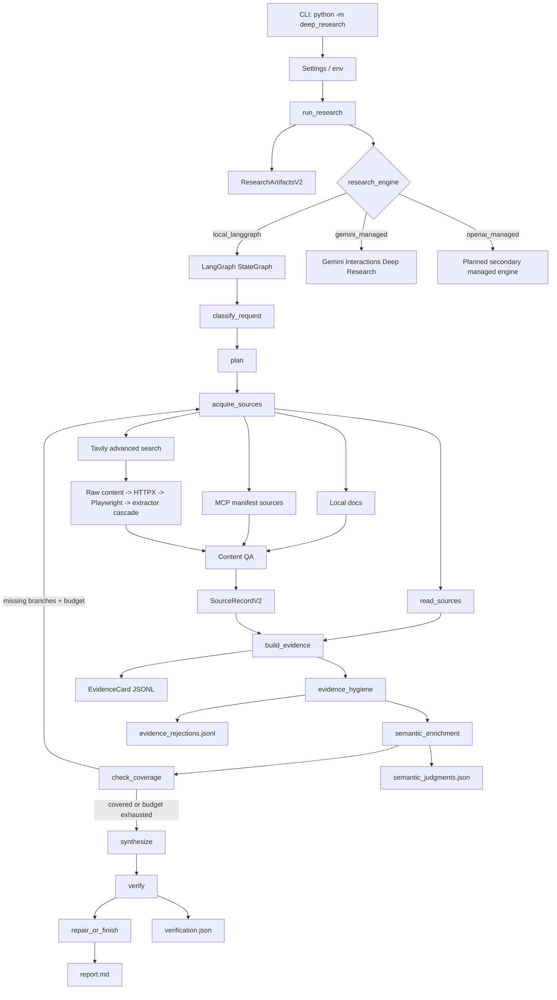

# Deep Research Agent Architecture

## Purpose

Deep Research Agent is now a graph-enforced research engine. The system is no longer driven by a prompt-led DeepAgents orchestrator that may or may not delegate correctly. A custom LangGraph controller owns the lifecycle, artifacts, status events, source quality gates, evidence-card extraction, coverage checks, synthesis, verification, and resume checkpoints.

The design goals are:

- **Graph-enforced workflow**: no model can skip planning, source acquisition, evidence extraction, coverage, synthesis, or verification.
- **Evidence first**: final prose is synthesized from evidence cards, not free-form researcher notes.
- **Source QA before citation**: candidates must pass content length, boilerplate rejection, branch relevance, source quality, and extraction metadata checks before becoming citable.
- **Durable runs**: v2 artifacts and graph checkpoints make failed long-running work inspectable and resumable.
- **Engine choice**: local LangGraph research is the default; Gemini managed Deep Research is available as the first external benchmark/fallback path.
- **Safe progress**: `research_status` events expose phase, source counts, missing branches, and verifier failures without hidden reasoning.

## Runtime Flow



## State And Artifacts

The active graph state is `ResearchState`:

- `request`
- `plan`
- `source_candidates`
- `source_records`
- `evidence_cards`
- `coverage_matrix`
- `draft_report`
- `verification`
- `metrics`
- `failures`

The primary structured objects are:

- `ResearchPlan`
- `ResearchBranch`
- `SourceRequirement`
- `SourceRecordV2`
- `EvidenceCard`
- `CoverageMatrix`
- `VerificationResultV2`
- `RunManifestV2`

Every run writes v2 artifacts under `runs/<timestamp-slug>/`:

- `request.json`
- `plan.json`
- `activity.jsonl`
- `activity.md`
- `activity.html`
- `sources.jsonl`
- `evidence_cards.jsonl`
- `coverage.json`
- `report.md`
- `verification.json`
- `metrics.json`
- `manifest.json`
- `model_routes.json`
- `checkpoints/latest.json`
- `checkpoints/<phase>.json`
- `source_docs/source_<id>.md`
- `failure.json` and `error.txt` when a run-ending failure occurs

`manifest.json` is the redacted reproducibility manifest. It includes schema version, engine, mode, progress mode, model routes, runtime package versions, key-pool counts, and settings without API key values.

## Engines

### local_langgraph

`local_langgraph` is the default balanced-deep engine. It uses a deterministic baseline plan plus optional JSON-only LLM semantic plan enrichment, followed by graph-enforced source/evidence/coverage/verification gates. The planner does not use subject-specific branch factories or fixed intent routing. It extracts explicit request segments and keyphrases from short or paragraph-length prompts, can accept a validated model-proposed branch plan, deduplicates overlapping angles, and creates adaptive `branch_N` research branches whose titles, objectives, queries, and required terms come from the actual request.

Balanced mode targets adaptive branch coverage, 8-16 searches, at least 17 usable sources where branch requirements demand it, and 80-120 candidates before verifier-gated synthesis.

### gemini_managed

`gemini_managed` uses the Gemini Interactions API with `agent="deep-research-pro-preview-12-2025"` and `background=True`. The managed report is converted into the same v2 artifact surface where possible and marked with managed provenance.

Command:

```powershell
python -m deep_research managed gemini "question"
```

### openai_managed

`openai_managed` is reserved for a later managed provider integration. The CLI exposes the engine, but the runner intentionally raises a structured not-implemented failure until the provider lifecycle is wired and tested.

## Source Acquisition

The local engine acquires evidence by branch, not through one generic search query. Each branch carries queries, required terms, and minimum source counts. The acquisition layer supports:

- public web via Tavily advanced search with raw content and `chunks_per_source=3`
- local files: PDF, DOCX, Markdown, TXT, CSV/XLSX, HTML
- MCP connector payloads through a JSON manifest

Web extraction uses a cascade:

1. Tavily raw content when available
2. HTTPX fetch with retryable status handling, redirects, dynamic browser-compatible headers, text/PDF support, and meta-refresh following
3. Playwright-rendered HTML with dynamic page settling
4. structured article JSON extraction
5. `trafilatura` precision/balanced/recall variants
6. readability, newspaper4k, Goose3, jusText, selectolax, and Inscriptis fallbacks when installed
7. BeautifulSoup parser-registry discovery, markdownify, and lxml text extraction as last-resort fallbacks

Sources that are too short, boilerplate-heavy, bot-protected, access-controlled, low relevance, or low quality are rejected before citation. The scraper improves extraction breadth without bypassing authentication, paywalls, CAPTCHA, or explicit access controls.

## Verification

`verification.json` now uses `VerificationResultV2`, which combines deterministic citation checks with semantic gates:

- citation validity
- source support
- answer coverage
- branch coverage
- evidence-card linkage
- source quality minimum
- report structure score
- weakly supported claims

A report is valid only when the final answer is cited, sources are usable records, evidence cards link to cited claims, branch coverage is sufficient, and cited paragraphs overlap with their source text.

## CLI

Primary commands:

```powershell
python -m deep_research run "question"
python -m deep_research resume RUN_ID
python -m deep_research verify RUN_ID
python -m deep_research managed gemini "question"
```

The old shorthand still works:

```powershell
python -m deep_research "question"
```

Useful options:

- `--mode fast|balanced|max_quality`
- `--engine local_langgraph|gemini_managed|openai_managed`
- `--input path`
- `--mcp-manifest path/to/manifest.json`
- `--min-usable-sources N`
- `--max-search-queries N`
- `--max-candidates N`
- `--min-source-words N`
- `--allow-weak-tool-models`
- `--progress live|raw|quiet`

## Model Policy

The local graph enforces a strict model capability policy by default. Tool-heavy roles must route to proven cloud/tool-calling model families. Local or weak models can be used for utility roles only unless the user opts out with:

```powershell
python -m deep_research run --allow-weak-tool-models "question"
```

This exists because the old system’s core failure mode was prompt-driven delegation and fragile tool calling. The graph now enforces workflow shape, and model policy prevents known weak tool-call models from being assigned to roles that cannot tolerate tool-call failure.
