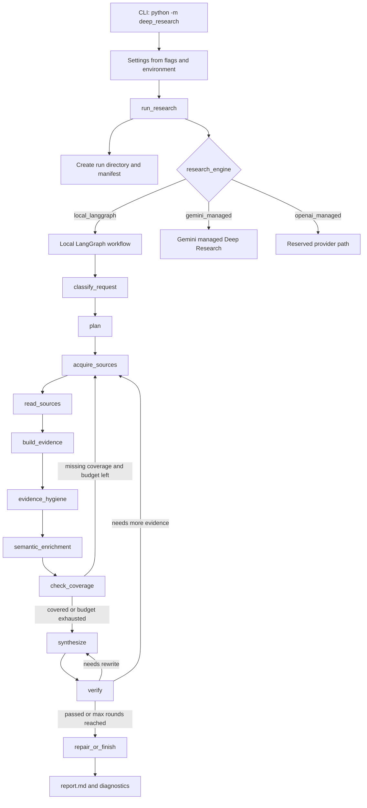
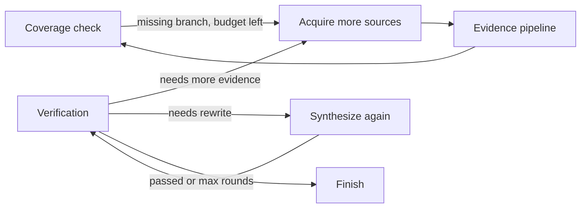

# Deep Research Agent Architecture

This document explains the system in a way that can be read aloud or used to walk
someone through the project. The short version is: Deep Research Agent turns a
research question into an audited run folder. It plans the work, gathers sources,
extracts evidence, checks coverage, writes a report, verifies the report, and
keeps every important artifact so the run can be inspected or resumed.

## How To Explain The System Quickly

One-sentence explanation:

> Deep Research Agent is a graph-controlled research pipeline that converts a
> question into a verified, citation-backed Markdown report with a complete audit
> trail of sources, evidence, coverage, verification, and metrics.

Thirty-second explanation:

> A user gives the CLI a research question. The runner creates a sandboxed run
> directory, records the settings, and chooses an engine. The default engine is a
> local LangGraph workflow. That graph plans the research branches, searches and
> ingests sources, filters unusable pages, extracts evidence cards, checks whether
> each branch is covered, writes a draft report, verifies citations and source
> support, and either accepts the report or stores a failed draft with diagnostics.

Two-minute explanation:

> The system is designed to avoid the common failure mode where an LLM simply
> writes a confident report from weak or uncited notes. The graph owns the process.
> Models can help with planning, semantic checks, and final writing, but they do
> not control whether the workflow skips source acquisition, evidence extraction,
> coverage, or verification. Every run writes durable artifacts under `runs/`.
> Those artifacts include the plan, source records, source documents, evidence
> cards, coverage matrix, draft report, verification result, metrics, checkpoints,
> model route manifest, activity log, and failure report when something breaks.

## Main Runtime Flow



The key idea is that `research_graph.py` is the controller. It defines the stage
order and the loops. The LLM is a worker inside selected stages, not the owner of
the lifecycle.

## Main Components

| Component | Main file | What it does |
| --- | --- | --- |
| CLI | `deep_research/cli.py` | Parses commands, flags, and questions, then builds `Settings`. |
| Runner | `deep_research/agent.py` | Creates artifacts, writes manifests, chooses the engine, handles failures, and returns paths. |
| Artifact layer | `deep_research/artifacts.py`, `deep_research/artifacts_v2.py` | Creates sandboxed run directories and writes path-safe files. |
| Local workflow | `deep_research/research_graph.py` | Defines the LangGraph stages, checkpoints, resume entry points, and retry loops. |
| Planning | `deep_research/planning.py`, `deep_research/semantic_planning.py` | Builds deterministic branches and optionally accepts JSON-only LLM plan enrichment. |
| Acquisition | `deep_research/acquisition.py`, `deep_research/scraper.py`, `deep_research/ingestion.py` | Searches Tavily, ingests local/MCP documents, scrapes pages, validates source relevance, and writes source records. |
| Evidence | `deep_research/evidence.py`, `deep_research/evidence_hygiene.py`, `deep_research/semantic.py` | Extracts evidence cards, removes noisy cards, and optionally runs semantic evidence checks. |
| Coverage | `deep_research/coverage.py` | Checks branch source counts, evidence presence, and required-term coverage. |
| Synthesis | `deep_research/synthesis.py` | Builds the report blueprint and writes either an LLM report or deterministic fallback report. |
| Verification | `deep_research/verifier_v2.py` | Checks citations, source support, coverage, quality, structure, task fit, cleanliness, language, and depth. |
| Managed engine | `deep_research/managed.py` | Runs Gemini managed Deep Research and normalizes its output into the artifact surface. |
| Model policy | `deep_research/model_policy.py`, `deep_research/model_router.py` | Routes model roles, describes model routes, retries/fallbacks, and blocks weak tool models by default. |

## Entry Points

The most common command is:

```powershell
python -m deep_research run "How do urban heat islands affect public health?"
```

The CLI also supports the old shorthand:

```powershell
python -m deep_research "How do urban heat islands affect public health?"
```

Other important commands:

```powershell
python -m deep_research resume RUN_ID
python -m deep_research verify RUN_ID
python -m deep_research managed gemini "question"
```

At code level, the central entry point is:

```python
run_research(question, settings)
```

That function returns a `ResearchRunResult` containing the run directory, report
path, verification path, and metrics path.

## Work Plan Process

### 1. Receive The Request

The CLI joins the question text, reads flags, and builds a `Settings` object.
Settings include the engine, mode, source limits, model routes, local input
paths, MCP manifest path, verification toggles, and progress mode.

Important defaults:

- `research_engine` defaults to `local_langgraph`.
- `mode` defaults to `max_quality` in the CLI.
- LLM planning, LLM synthesis, semantic verification, model fallbacks, and strict
  tool-model policy are enabled by default.

### 2. Create The Run Folder

`run_research()` creates a new directory under `runs/` using a UTC timestamp and
a slug from the question. Example:

```text
runs/20260604T100000Z-how-do-urban-heat-islands-affect-public-health/
```

The artifact layer creates standard folders and files:

- `findings/`
- `source_docs/`
- `documents/`
- `checkpoints/`
- `activity.jsonl`
- `activity.md`
- `sources.jsonl`
- `evidence_cards.jsonl`

All artifact reads and writes go through a path-safe wrapper so tools cannot
write outside the run directory.

### 3. Write The Manifest

Before doing research, the runner writes:

- `manifest.json`
- `model_routes.json`

For local runs, the manifest records the question, engine, mode, progress mode,
redacted settings, runtime metadata, and model routes. API key values are not
written. This makes the run reproducible without leaking secrets.

### 4. Choose The Engine

The runner chooses one of three engine paths:

- `local_langgraph`: the default graph-controlled local workflow.
- `gemini_managed`: a managed Gemini Deep Research interaction.
- `openai_managed`: reserved and intentionally not implemented yet.

For the local engine, the runner first validates model policy and ingests any
local files or MCP manifest documents. For Gemini managed mode, the runner sends
the request to the managed provider and stores the returned report and parsed
sources in the normal artifact layout.

### 5. Classify The Request

The local graph starts at `classify_request`.

This stage checks that the question is non-empty, stores the request payload in
`request.json`, and emits a visible progress event. It also writes a checkpoint
so a run can resume after this point.

Output:

- `request.json`
- `checkpoints/classify_request.json`
- `checkpoints/latest.json`

### 6. Build The Research Plan

The `plan` stage creates a `ResearchPlan`.

The deterministic planner breaks the question into one or more research branches.
Each branch has:

- an `id`, such as `branch_1`
- a title
- an objective
- search queries
- source type preferences
- a minimum usable source count
- required terms or concepts
- completion criteria

If LLM planning is enabled, the system asks the planner model for JSON-only plan
enrichment. The enrichment is accepted only if it passes schema and quality
checks. If the model returns bad JSON or a vague plan, the deterministic plan
continues as the fallback.

Output:

- `plan.json`
- `plan_enrichment.json`
- `checkpoints/plan.json`

### 7. Acquire Sources

The `acquire_sources` stage gathers source candidates and turns usable candidates
into `SourceRecordV2` objects.

Source inputs can come from:

- Tavily public web search
- local files passed with `--input`
- connector content passed with `--mcp-manifest`

The acquisition process is branch-based. Each branch has its own queries and
minimum source count. If a branch is under-covered later, the graph can return to
this stage with focus terms from the missing coverage or verification failures.

For web sources, the process is:

1. Search Tavily with advanced search options.
2. Register candidates with URL, title, snippet, query, and raw content when available.
3. Use Tavily raw content if it is already long enough.
4. Otherwise fetch with the scraper.
5. Validate that the content is long enough, relevant to the branch, and not mostly boilerplate.
6. Score source quality.
7. Write accepted source text to `source_docs/source_<id>.md`.
8. Write accepted source metadata to `sources.jsonl`.

The scraper tries HTTP first and Playwright second. It supports text and PDF
responses, follows redirects and meta refreshes, rejects bot-protection or
paywall-like pages, and uses extractor fallbacks such as trafilatura,
readability, newspaper, Goose, BeautifulSoup, and markdownify when available.

Output:

- `sources.jsonl`
- `source_docs/source_<id>.md`
- acquisition metrics inside `metrics`
- `checkpoints/acquire_sources.json`

### 8. Read Sources

The `read_sources` stage loads source documents from `source_docs/` back into
memory. This gives later stages access to full source text without depending on
network access again.

Output:

- `checkpoints/read_sources.json`

### 9. Build Evidence Cards

The `build_evidence` stage converts usable source text into evidence cards.

An `EvidenceCard` is a compact, source-linked claim:

- `source_id`
- `branch_id`
- claim text
- supporting excerpt
- source title and URL
- quality and relevance scores
- confidence
- limitations

The system ranks source sentences by overlap with the branch terms and original
question. It keeps a small number of useful cards per source so the report is
built from evidence rather than entire scraped pages.

Output:

- `evidence_cards.jsonl`
- `checkpoints/build_evidence.json`

### 10. Clean Evidence

The `evidence_hygiene` stage removes cards that are not useful report evidence.
It rejects cards that are too short, too long, URL-heavy, markdown-link-heavy,
metadata-shaped, duplicated, repetitive, or below confidence threshold.

Output:

- rewritten `evidence_cards.jsonl`
- `evidence_rejections.jsonl`
- `checkpoints/evidence_hygiene.json`

### 11. Run Semantic Evidence Checks

The `semantic_enrichment` stage optionally asks a judge model to score whether
evidence cards are semantically useful for the research plan. This is controlled
by `semantic_verification`.

The stage records judgments, rejected cards, failures, and metrics. Cards that
survive are written back to `evidence_cards.jsonl`.

Output:

- `semantic_judgments.json`
- `semantic_evidence_rejections.jsonl`
- rewritten `evidence_cards.jsonl`
- `checkpoints/semantic_enrichment.json`

### 12. Check Coverage

The `check_coverage` stage builds a `CoverageMatrix`.

For each branch it checks:

- whether the branch has enough usable sources
- whether the branch has evidence cards
- whether required terms or concepts are covered

If coverage is incomplete and search budget remains, the graph loops back to
`acquire_sources`. If acquisition has plateaued or the budget is exhausted, the
graph moves forward to synthesis with whatever evidence exists.

Output:

- `coverage.json`
- `checkpoints/check_coverage.json`

### 13. Synthesize The Report

The `synthesize` stage builds a report blueprint and writes a draft.

If `llm_synthesis` is enabled, the orchestrator model receives the plan,
coverage, evidence cards, allowed sources, previous verification failures, and
writing guidance. It must write Markdown using only the provided evidence cards
and cite source IDs, not evidence card IDs.

If LLM synthesis is disabled, the system writes a deterministic report from the
evidence cards.

Important behavior:

- The accepted final report is not written immediately.
- The stage writes the generated report to `draft_report.md`.
- `report.md` is temporarily set to a "draft pending verification" notice.

Output:

- `report_blueprint.json`
- `draft_report.md`
- temporary `report.md`
- `checkpoints/synthesize.json`

### 14. Verify The Report

The `verify` stage checks the draft with `verify_report_v2()`.

The verifier checks:

- inline citations exist
- every cited ID is a usable source
- every cited source appears in `## Sources`
- no uncited factual paragraph remains
- cited paragraphs overlap with source text
- the answer covers the plan and acceptance criteria
- branch coverage is complete
- cited sources have evidence cards
- cited source breadth meets the configured target
- average source quality is high enough
- cited sources still align with the active branch and request
- report structure is sufficient
- report text is clean and does not leak scrape artifacts or internal diagnostics
- output language matches the question
- report depth is proportional to the task

If semantic verification is enabled, the graph also runs semantic report
verification and merges those results into `verification.json`.

Output:

- `verification.json`
- `semantic_verification.json` when semantic verification is enabled
- `checkpoints/verify.json`

### 15. Repair, Retry, Or Finish

After verification, the graph decides what to do next:

- If verification passes, finish.
- If failures indicate missing coverage, weak evidence, low source quality, or
  missing context, return to `acquire_sources` when acquisition can still make progress.
- If failures mainly indicate unsupported wording or citation weakness, return
  to `synthesize` and rewrite from the existing evidence.
- If the maximum round count is reached, finish with diagnostics.

The final `repair_or_finish` stage writes:

- the accepted `report.md` when verification passed or failed reports are allowed
- `failed_report.md` when a draft exists but did not pass
- a failure notice in `report.md` when the run failed verification
- final `metrics.json`
- `checkpoints/finish.json`

If `allow_failed_verification` is false, `run_research()` raises
`ResearchRunError` after writing `failure.json`, `error.txt`, and diagnostic
artifacts.

## Feedback Loops

The local workflow has two important loops.



These loops are what make the system a research workflow rather than a single
LLM prompt. The report can only become final after the graph has either passed
verification or exhausted the configured repair budget.

## Artifact Map

Each run directory is the audit trail. The most important files are:

| Artifact | Meaning |
| --- | --- |
| `request.json` | Normalized user request, engine, mode, and writing guidance. |
| `manifest.json` | Run metadata. Local runs include redacted settings, runtime metadata, and model route details. |
| `model_routes.json` | Model roles, providers, key slots, fallbacks, and timeout configuration without secret values. |
| `plan.json` | The accepted research plan used by the graph. |
| `plan_enrichment.json` | Whether LLM plan enrichment was used and accepted, plus failures when rejected. |
| `sources.jsonl` | One usable source record per line. |
| `source_docs/source_<id>.md` | Full extracted text for each usable source. |
| `evidence_cards.jsonl` | Clean evidence claims linked to source IDs and branch IDs. |
| `evidence_rejections.jsonl` | Evidence cards rejected by deterministic hygiene checks. |
| `semantic_judgments.json` | Semantic evidence-gate results when enabled. |
| `semantic_evidence_rejections.jsonl` | Evidence cards rejected by semantic checks. |
| `coverage.json` | Branch coverage, missing points, source counts, and coverage score. |
| `report_blueprint.json` | The structure and writing contract passed into synthesis. |
| `draft_report.md` | The generated report before acceptance. |
| `report.md` | The accepted report, or a failure notice if verification failed. |
| `failed_report.md` | The unaccepted draft when verification failed. |
| `verification.json` | Verification scores, cited IDs, failures, unsupported claims, and weak claims. |
| `semantic_verification.json` | Semantic report check results when enabled. |
| `metrics.json` | Public run metrics and final status values. |
| `activity.jsonl` | Machine-readable visible progress events. |
| `activity.md` | Human-readable progress log. |
| `activity.html` | Browser-friendly progress dashboard when generated. |
| `checkpoints/latest.json` | Most recent graph state. |
| `checkpoints/<phase>.json` | Phase-specific graph state for resume/debugging. |
| `failure.json` | Structured failure category and suggested action when the run fails. |
| `error.txt` | Simple error text for quick inspection. |

## Data Objects

The core schema objects live in `deep_research/schemas.py`.

| Object | Purpose |
| --- | --- |
| `ResearchPlan` | The full plan for the question. |
| `ResearchBranch` | One research angle with queries, source needs, and completion criteria. |
| `SourceCandidate` | A search result before full validation. |
| `SourceRecordV2` | A usable source with provenance, quality, relevance, and content path. |
| `EvidenceCard` | A concise source-backed claim used for synthesis. |
| `CoverageMatrix` | A branch-by-branch view of what is covered and missing. |
| `VerificationResultV2` | The final verification scores, failures, citations, and weak-claim diagnostics. |
| `RunManifestV2` | Run metadata for reproducibility. |
| `ResearchState` | The graph state passed between workflow nodes. |

## Source Acquisition In Plain Language

The system does not treat all search results as sources. It separates candidates
from usable sources.

Candidate:

> "This URL appeared in search results and might be useful."

Usable source:

> "This URL was fetched or ingested, produced enough readable content, matched
> the active branch, passed quality checks, and was written into the run folder."

This distinction matters because final reports may cite only usable sources.
Search-only candidates, rejected pages, bot-protected pages, access-controlled
pages, and low-content pages are not valid citation material.

## Verification In Plain Language

Verification asks a simple question in many different ways:

> Did the report answer the user's exact request using only enough clean,
> source-backed evidence?

The verifier does not just check that citations are present. It checks whether
the cited sources exist, whether the cited text overlaps with source text,
whether branch requirements were covered, whether enough evidence-backed sources
were cited, whether the report drifted off topic, and whether the writing hides
internal diagnostics or scrape artifacts.

## Resume Behavior

Resume is based on checkpoints. Every graph stage writes:

- `checkpoints/latest.json`
- `checkpoints/<phase>.json`

When `python -m deep_research resume RUN_ID` runs, the system loads the latest
checkpoint, infers the right next graph node, and continues. For example:

- if the last checkpoint was `plan`, resume at `acquire_sources`
- if sources already exist, resume can continue at `read_sources`
- if synthesis already happened, resume can continue at `verify`

This makes long-running research inspectable and recoverable.

## Failure Handling

Failures are not hidden behind a success-looking report.

When a run-ending exception occurs, `run_research()` writes:

- `failure.json`
- `error.txt`
- `metrics.json`
- `verification.json` if no verification file exists yet

When verification fails, the system archives the rejected draft into
`failed_report.md` and writes a failure notice to `report.md`. The CLI exits with
an error unless `--allow-failed-verification` is enabled.

## Model And Provider Policy

The local graph uses model roles:

- orchestrator
- planner
- researcher
- analyst
- verifier
- judge
- fast

`model_router.py` resolves those roles to provider/model specs and records the
route manifest. `model_policy.py` blocks weak local models from tool-heavy roles
by default, because the workflow depends on reliable structured model output in
planning, synthesis, and semantic verification.

The user can opt out with:

```powershell
python -m deep_research run --allow-weak-tool-models "question"
```

That is useful for experimentation, but it weakens reliability.

## Managed Gemini Path

The Gemini managed path is separate from the local graph.

`run_gemini_managed_research()` creates a Gemini interaction with:

```text
agent = deep-research-pro-preview-12-2025
background = true
```

The code polls until the provider finishes or fails. When complete, it writes the
managed report to `report.md`, parses source lines where possible, stores those
as `SourceRecordV2` records with `managed_gemini` provenance, and writes
verification and metrics artifacts.

## Current Runtime Versus Legacy DeepAgents Files

The current v2 runtime does not use the old prompt-led DeepAgents orchestrator in
normal CLI execution. In `deep_research/agent.py`, `create_agent()` is a
compatibility placeholder that raises and says DeepAgents orchestration has been
replaced by the v2 LangGraph research engine.

`subagents.yaml` and `deep_research/subagents.py` remain in the repository for
compatibility and tests around the older subagent configuration. They are useful
historical context, but the normal architecture to explain is the LangGraph
pipeline in `deep_research/research_graph.py`.

## How To Read A Run Directory

When explaining or debugging a completed run, inspect files in this order:

1. `report.md` to see the accepted report or failure notice.
2. `verification.json` to see whether the report passed and why.
3. `coverage.json` to see which branches were complete or missing.
4. `plan.json` to understand what the system tried to answer.
5. `sources.jsonl` and `source_docs/` to inspect the evidence base.
6. `evidence_cards.jsonl` to see what claims were available to synthesis.
7. `activity.md` or `activity.html` to reconstruct visible progress.
8. `failure.json` and `error.txt` when the run did not complete cleanly.

## Explanation Script

Use this script when presenting the architecture:

> The user starts with a question. The CLI turns flags and environment variables
> into settings, then `run_research()` creates a new run folder. The runner writes
> a manifest so we know exactly which engine, model routes, limits, and settings
> were used. By default, it runs the local LangGraph engine.
>
> The graph first records the request, then builds a research plan. The plan is
> made of branches, and each branch has search queries, required concepts, and a
> minimum number of usable sources. The graph then acquires sources branch by
> branch. A search result is only a candidate; it becomes citable only after it
> has readable content, enough words, branch relevance, and acceptable quality.
>
> After source acquisition, the graph reads the saved source documents and
> extracts evidence cards. Each evidence card is a claim plus a supporting
> excerpt tied to a source ID. Hygiene and semantic checks remove noisy or weak
> cards. Then coverage checks whether each branch has enough sources and evidence.
> If coverage is missing and budget remains, the graph searches again with a
> sharper focus.
>
> Once coverage is good enough, the system synthesizes a draft report from the
> evidence cards. The draft is not accepted immediately. Verification checks
> citations, source support, branch coverage, source quality, topic alignment,
> report structure, cleanliness, language, and depth. If verification finds that
> more evidence is needed, the graph goes back to acquisition. If the evidence is
> enough but the prose is weak, it rewrites. Only after verification passes, or
> the configured repair budget is exhausted, does the graph finish and write the
> final artifacts.
