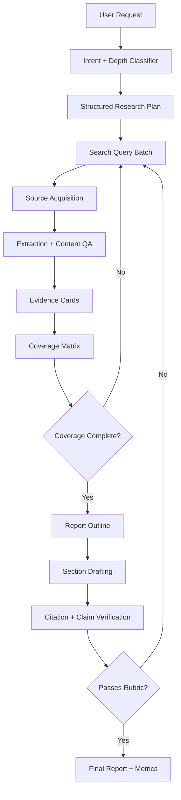

# Deep Research Agent Gap Analysis and Restructure Plan

Date: 2026-06-03

## Executive Summary

The current agent is good at creating run directories, registering sources, scraping pages, and checking citation structure. It is not yet a strong deep-research system. The main issue is not that the final prompt is too weak; the whole research loop is too shallow, too model-dependent, and too easy for weak evidence to pass verification.

The strongest commercial Deep Research systems are built as long-running research workflows: plan, search, read, revise the plan, search again, compare evidence, synthesize, critique, and repair. Google describes Gemini Deep Research as a system that turns prompts into multi-point plans, decides which tasks can run in parallel or sequence, iteratively searches and reads, identifies missing information and discrepancies, and performs self-critique before writing the report. Google also says its API Deep Research workflow may use about 80 searches and 250k input tokens for a typical moderate task, while Deep Research Max may use up to about 160 searches and 900k input tokens. OpenAI describes Deep Research as an agent optimized for web browsing and data analysis that can search, interpret, and analyze large amounts of text, images, and PDFs, pivoting as needed.

Our current default path can collect only one usable source for a broad conceptual prompt, then hand a short source excerpt to a small or brittle tool-calling model. In recent local runs for `what is fine tuning`, the agent either never wrote `report.md`, or wrote a deterministic recovery report that passed verification despite being irrelevant:

```text
Scalable Differential Privacy with Sparse Network Fine-Tuning
Scalable Differential Privacy with Sparse Network Fine-Tuning [1]
```

That report passed because the verifier checked that the cited words existed in the scraped source, not whether the report answered the user's question. To match Gemini-style output, the system needs a deterministic research controller, stronger source acquisition, evidence cards, report-quality rubrics, semantic verification, and safer progress summaries.

## What Gemini Did Better in the User Example

Gemini's run had the right shape for a broad explanatory question:

- It expanded a short prompt into a six-part research plan: definition, contrast with pre-training and prompting, fine-tuning methods, benefits and use cases, limitations/risks, and synthesis.
- It ran multiple search waves, not a single query.
- It used source diversity: papers, vendor docs, technical blogs, forums, and explanatory sources.
- It produced progress summaries that explained the current research frontier: taxonomy, methods, memory economics, alignment methods, catastrophic forgetting, and decision framework.
- It generated a report with sections, comparative tables, technical details, caveats, and a conclusion.

The important point: the quality came from iterative scoped research and synthesis, not just from a better final writing prompt.

## Current Local Architecture

The repo already has useful foundations:

- `deep_research/agent.py` creates per-run artifacts, writes `run_manifest.json`, starts source precollection, builds the DeepAgents graph, captures stream updates, and finalizes report, verification, metrics, and recovery artifacts.
- `deep_research/tools.py` exposes `web_search`, `deep_scrape`, `collect_sources`, file tools, `verify_report_file`, and `python_repl`.
- `deep_research/source_registry.py` assigns source IDs, deduplicates URLs, persists `sources.jsonl`, and writes scraped markdown under `source_docs/`.
- `deep_research/verifier.py` enforces citation shape, cited-source existence, scraped-source use, and a lexical source-support score.
- `subagents.yaml` defines planner, researcher, analyst, and verifier roles.
- `skills/comprehensive-report/SKILL.md` describes a stronger report workflow, but the current agent does not actually attach that skill to the subagents.

This is a good scaffold. The missing part is a high-quality research policy that controls the loop instead of hoping the model does everything correctly.

## Local Evidence from Recent Runs

### Run: `runs/20260603T142040Z-what-is-fine-tuning`

Observed issues:

- Model route used local Ollama models: orchestrator `qwen2.5:7b`, planner/researcher/verifier `qwen2.5:3b`.
- Precollection gathered only one usable source.
- The run spent about 25 minutes in the research stream.
- The agent eventually ran `verify_report_file("report.md")`, but `report.md` did not exist.
- `verification.json` recorded `Report file not found: report.md`.
- `metrics.json` and `transcript.log` were missing, which means runner finalization did not complete.

This points to a lifecycle problem: a long-running CLI process can end without durable finalization, and weak local models are not reliable enough for this tool-heavy workflow.

### Run: `runs/20260603T134008Z-what-is-fine-tuning`

Observed issues:

- Groq tool calling failed with `tool_call_parse_error`.
- Deterministic recovery wrote `report.md` from scraped source sentences.
- The source extraction for Stanford HAI captured related-page boilerplate rather than the definition.
- The final report was irrelevant but verification passed with `citation_validity_score: 1.0` and `source_support_score: 1.0`.

This exposes two root problems:

- Source extraction can produce "usable" documents that contain the wrong content.
- Verification proves lexical source overlap, not answer quality or claim relevance.

## Root Causes

### 1. The Research Budget Is Far Too Small

In `deep_research/agent.py`, `_precollect_sources()` sets:

```python
target_count = max(1, min(context.settings.max_sources, 3))
```

In `deep_research/tools.py`, `collect_sources()` caps the default candidate limit around `target * 3`, with a hard cap of 10. In recent runs, `what is fine tuning` collected only one usable source.

For comparison, Google says a moderate Deep Research API task may use around 80 search queries, and Deep Research Max may use up to around 160. We do not need to copy those numbers for every run, but one source is not a deep research budget.

### 2. The Plan Is Generic Instead of Topic-Specific

`_render_research_plan()` writes the same five generic steps for every question. The planner prompt in `subagents.yaml` asks for a concise plan, but the deterministic baseline does not require:

- subquestions
- target source types
- query list
- source quotas
- report outline
- coverage matrix
- acceptance rubric beyond citation validity

For `what is fine tuning`, the system should deterministically infer an explanatory report structure: definition, pre-training comparison, prompt/RAG comparison, methods, use cases, limitations, costs, and decision guidance.

### 3. Search Uses Basic Result Collection

`search_candidates()` calls:

```python
context.search_client.search(cleaned, max_results=bounded_results)
```

It does not request Tavily advanced search, multiple chunks per source, raw content, domains, or source-type-specific query branches. Tavily's docs say advanced search is tailored for more relevant sources and snippets, supports `chunks_per_source`, and `include_raw_content` can retrieve parsed content directly.

### 4. Source Extraction Is Too Brittle

`deep_research/scraper.py` converts a selected DOM node with `markdownify`. It rejects pages with fewer than 40 words, but that threshold allowed the Stanford HAI scrape to pass even though it mostly contained related content. The source was then used for report recovery.

The code should use stronger extraction paths:

- Tavily raw content when available.
- `trafilatura.extract(..., output_format="markdown", include_tables=True, favor_precision=True)` for boilerplate removal.
- `readability-lxml` as a fallback for main article extraction.
- Site-specific fallback for Next.js pages by reading embedded JSON state where possible.
- A content QA check that rejects pages whose extracted body does not cover the query intent.

Trafilatura's docs describe it as a wrapper for text extraction and conversion to formats including markdown, with options such as precision/recall controls, metadata, tables, and fallback extraction. That is a better fit than raw DOM markdown conversion alone.

### 5. Relevance Scoring Is Lexical and Too Easy to Satisfy

For `what is fine tuning`, the relevance scorer reduces the query to terms like `fine` and `tuning`. A page section titled "Scalable Differential Privacy with Sparse Network Fine-Tuning" can score highly even though it does not answer the definition question.

The relevance gate needs concept coverage, not just token overlap:

- Does the extracted source define the topic?
- Does it discuss the requested dimension?
- Does it contain enough non-boilerplate paragraphs?
- Does it map to at least one planned research branch?

### 6. Source Quality Does Not Enforce Evidence Diversity

`source_quality.py` gives useful domain-type hints, but source choice is still mostly a single ranked list. A strong report should deliberately gather a mix:

- official docs or product docs
- academic papers or surveys
- primary technical sources
- vendor documentation when practical
- recent sources when the question is current
- secondary explainers only when they add clarity

Gemini's own description of newer Deep Research Max emphasizes consulting more sources, using diverse sources, and weighing conflicting evidence.

### 7. Tool-Calling Reliability Is Not Treated as a Hard Requirement

Recent runs used small Ollama models and Groq models that produced tool-call parse failures. DeepAgents subagents and file tools require reliable tool calling. Small local models can be useful for summarization or classification, but they should not own the orchestrator, planner, researcher, or verifier roles in benchmark-grade DR mode.

Recommended default:

- Use a strong tool-calling model for orchestrator, planner, researcher, and verifier.
- Allow smaller models only for cheap utility tasks with structured schemas and retries.
- Add a runtime capability check before starting a deep run.
- If the user selects `ollama` or a small model, downgrade to "assisted summary" mode unless the model passes a tool-call smoke test.

### 8. Verification Checks Citations, Not Research Quality

`deep_research/verifier.py` uses a lexical support threshold of `0.28`. This catches some citation laundering, but it does not answer:

- Does the report answer the user's question?
- Are the necessary subtopics covered?
- Are the cited claims faithful to the source?
- Are there contradictions across sources?
- Are the sources authoritative enough?
- Is the report comprehensive enough for the selected mode?

Recent research on deep-research evaluation makes this distinction explicit. ReportBench focuses on cited literature relevance and statement faithfulness. Source-attribution work argues that citation evaluation must retrieve the cited content and judge link validity, relevance, and factual consistency. SourceBench evaluates source quality across content relevance, factual accuracy, objectivity, freshness, authority/accountability, and clarity.

### 9. Deterministic Recovery Can Produce Valid Garbage

`_deterministic_report_from_sources()` is useful as a fallback, but it currently extracts "relevant" source sentences using token overlap. If extraction is bad, recovery turns bad extraction into a valid-looking report. Recovery should be renamed and constrained:

- It should produce `evidence_extract.md`, not a final report, unless an answer-coverage check passes.
- It should require minimum answer coverage for the original question.
- It should mark `report_reconstructed` as invalid for benchmark quality unless a semantic judge approves.

### 10. Report Synthesis Has No Strong Template or Rubric

The orchestrator prompt says "benchmark-grade public-web research reports," but it does not define mode-specific report depth, expected sections, tables, or writing standards. Gemini's API docs explicitly recommend steering reports with desired sections, tables, and audience tone. Our system should do the same automatically based on question type.

### 11. Progress Logs Are Observable but Not Insightful

The current activity log is honest and useful, but it mostly shows tool events. Gemini-style progress summaries are not private chain-of-thought; they are user-facing summaries of what the agent is doing, what it has learned, and what it will investigate next. Google exposes `thinking_summaries` for streaming Deep Research and describes collaborative planning. We should implement safe research-status summaries derived from state, not hidden reasoning.

### 12. The Runtime Is Not Durable Enough for Long-Horizon Research

Google describes Deep Research tasks as background executions that can take minutes and be polled or streamed. OpenAI similarly presents Deep Research as a tens-of-minutes workflow. Our CLI run depends on a single foreground process completing. If interrupted, finalization may not happen and artifacts can remain half-written.

## Target Architecture

The fix is to move from "LLM agent with tools" to "deterministic research workflow with LLM workers."



### Core State Objects

Add explicit state objects instead of passing free-form text between subagents:

```python
ResearchPlan:
    question: str
    intent: Literal["explain", "compare", "market", "technical", "decision", "literature"]
    audience: str
    report_outline: list[SectionSpec]
    branches: list[ResearchBranch]
    source_requirements: list[SourceRequirement]
    acceptance_rubric: Rubric

ResearchBranch:
    id: str
    objective: str
    queries: list[str]
    source_types: list[str]
    min_sources: int
    completion_criteria: list[str]

EvidenceCard:
    source_id: int
    branch_id: str
    claim: str
    supporting_excerpt: str
    source_url: str
    source_type: str
    quality_score: float
    relevance_score: float
    freshness: str | None
    limitations: list[str]

CoverageMatrix:
    branch_id: str
    required_points: list[str]
    covered_points: list[str]
    missing_points: list[str]
    conflicting_points: list[str]
```

The LLM can generate and update these objects, but the controller should own the loop and write artifacts.

## Proposed Workflow

### Phase 1: Intent and Plan

For every user request, run a structured planner that outputs JSON:

- question interpretation
- audience and desired depth
- report outline
- research branches
- initial search queries
- source-type quotas
- acceptance criteria

For `what is fine tuning`, the deterministic plan should look like:

1. Define fine-tuning in ML, AI, and LLMs.
2. Compare fine-tuning with pre-training, continued pre-training, prompt engineering, and RAG.
3. Explain methods: full fine-tuning, SFT, RLHF/PPO, DPO/ORPO/SimPO, LoRA, QLoRA, DoRA, IA3, prompt/prefix tuning.
4. Cover use cases: domain adaptation, format control, tone, accuracy, safety/alignment.
5. Cover limits: data quality, cost, overfitting, catastrophic forgetting, evaluation burden.
6. Provide a decision framework: when to prompt, use RAG, fine-tune, or combine them.

### Phase 2: Search and Source Acquisition

Replace single-query precollection with branch-based source collection.

Recommended budgets:

| Mode | Branches | Search Queries | Usable Sources | Candidate Cap |
| --- | ---: | ---: | ---: | ---: |
| `fast` | 2-3 | 3-6 | 5-8 | 20-40 |
| `balanced` | 4-6 | 8-16 | 10-18 | 60-100 |
| `max_quality` | 6-10 | 20-40 | 20-40 | 150-250 |

These are still smaller than Google's own typical Deep Research API estimates, but they are much closer to the behavior users expect from a DR agent.

Implementation details:

- Add `collect_sources_batch(plan: ResearchPlan)` instead of only `collect_sources(query, target_count)`.
- Use Tavily `search_depth="advanced"` for balanced/max mode.
- Set `chunks_per_source=3` and consider `include_raw_content=True` where cost allows.
- Add `include_domains` and `exclude_domains` for branch-specific searches.
- Track source-type quotas per branch.
- Reject a source if it does not satisfy content QA after extraction.

### Phase 3: Extraction and Content QA

Every candidate should pass extraction QA before it is "usable":

- extracted word count above a threshold, probably 250-500 words for normal pages
- source title/body contains more than just query tokens
- at least one paragraph matches the branch objective
- page is not mostly related links, nav, product cards, or "similar terms"
- content language matches the expected language
- final source record stores extraction method, word count, relevant chunk count, and rejection reasons

Recommended extraction cascade:

1. Tavily raw content if returned.
2. Playwright rendered HTML.
3. Trafilatura markdown extraction.
4. Readability-lxml fallback.
5. Existing BeautifulSoup/markdownify fallback.
6. Site-specific JSON extraction for Next.js pages when available.

### Phase 4: Evidence Cards

Researchers should not write prose findings first. They should produce evidence cards:

- one claim per card
- exact supporting excerpt
- source ID
- branch ID
- confidence
- limitations
- source type

The final report should cite evidence cards, not arbitrary source files.

This also makes verification easier: every final paragraph can be mapped back to one or more evidence cards.

### Phase 5: Coverage Matrix and Gap Loop

After each source batch, run a coverage checker:

- Which plan branches are covered?
- Which required points are missing?
- Which sources disagree?
- Which sources are weak or outdated?
- Which search query should run next?

The controller should keep looping until:

- all required branches pass minimum coverage, or
- budget is exhausted and `Verification Notes` records the gaps.

This is the behavior Gemini appears to show in the user's example: each search wave narrows the missing technical dimensions.

### Phase 6: Report Synthesis

The synthesizer should receive:

- the structured plan
- the coverage matrix
- evidence cards grouped by section
- report format instructions
- mode-specific length target

Recommended default report requirements:

- Short answer / thesis first.
- Sectioned body based on plan.
- At least one comparison table for compare/technical explanation prompts.
- "Use cases" and "limitations" for explanatory technical concepts.
- "When to use / when not to use" decision guide where applicable.
- Inline citations in every factual paragraph.
- Source list containing cited scraped sources only.
- Explicit caveats when source coverage is incomplete.

### Phase 7: Verification and Repair

Verification needs multiple gates:

| Gate | Purpose | Current Status |
| --- | --- | --- |
| Citation syntax | Parse `[N]` and `## Sources` | Implemented |
| Scraped-source check | Ensure cited IDs were scraped | Implemented |
| Lexical support | Catch obvious citation mismatch | Implemented but weak |
| Answer coverage | Ensure report answers the question | Missing |
| Branch coverage | Ensure plan objectives are covered | Missing |
| Source quality | Ensure enough strong/primary sources | Missing |
| Citation relevance | Ensure cited source supports exact claim | Missing |
| Contradiction check | Surface disagreements | Missing |
| Report quality | Structure, tables, completeness, clarity | Missing |

Use deterministic checks where possible and an LLM judge only where semantic judgment is needed. ReportBench and recent citation-attribution work both support evaluating cited content against original sources rather than trusting the model's citations.

### Phase 8: Safe Research Progress Summaries

Implement a `research_status` event that is not hidden chain-of-thought. It should be generated from explicit state:

```text
Planning: split question into definition, comparison, methods, use cases, and risks.
Research: collected 4/10 target sources; missing primary sources for PEFT methods.
Gap: need stronger support for catastrophic forgetting and compute costs.
Next: search academic and official docs for LoRA, QLoRA, and catastrophic forgetting.
```

This gives users the Gemini-like feeling of depth without exposing private reasoning.

## Concrete Code Changes

### `deep_research/settings.py`

Add explicit depth budgets:

- `min_usable_sources`
- `max_search_queries`
- `max_candidates`
- `min_source_words`
- `min_relevant_chunks`
- `search_depth`
- `allow_raw_content`
- `semantic_verification`
- `report_quality_gate`

Stop deriving research quality almost entirely from provider mode. Model provider and research depth should be separate knobs.

### `deep_research/tools.py`

Add:

- `plan_search_queries(plan_json)`
- `collect_sources_batch(branches_json)`
- `validate_source_content(source_id, branch_id)`
- `write_evidence_cards(cards_json)`
- `read_evidence_cards(branch_id=None)`

Change `search_candidates()` to support Tavily advanced parameters:

```python
response = context.search_client.search(
    cleaned,
    max_results=bounded_results,
    search_depth=context.settings.search_depth,
    chunks_per_source=3,
    include_raw_content=context.settings.allow_raw_content,
)
```

Keep this configurable because advanced search and raw content cost more.

### `deep_research/scraper.py`

Add a robust extraction pipeline:

- trafilatura as primary main-text extractor
- readability-lxml fallback
- current BeautifulSoup selection as fallback
- source extraction metadata
- query-aware content QA

Reject pages that are short or off-topic even if they came from a high-quality domain.

### `deep_research/source_relevance.py`

Replace pure token overlap with a hybrid score:

- lexical overlap
- phrase coverage
- planned-branch coverage
- semantic embedding similarity or LLM classification
- title/body mismatch penalty
- boilerplate penalty

For short conceptual queries, expand the query terms before scoring. `what is fine tuning` should include `definition`, `pretrained model`, `task-specific data`, `transfer learning`, `model weights`, and `adaptation`.

### `deep_research/verifier.py`

Add:

- report-answer coverage score
- section coverage score
- per-claim citation entailment checks
- evidence-card linkage
- source-quality minimums
- citation density and citation distribution checks

Make deterministic recovery reports fail unless they meet answer coverage. The current recovery path should not be able to pass with an unrelated extract.

### `deep_research/agent.py`

Change the runner from model-led to controller-led:

- The controller writes `report.md`; models return structured data.
- Capture terminal content from all graph nodes, not only `node == "model"`.
- Always write `metrics.json` and `transcript.log` in a `finally` path.
- Add a run timeout and graceful finalization hook.
- Write periodic checkpoints so interrupted long runs can resume or at least finalize from existing evidence.

### `subagents.yaml`

Split the current broad researcher role:

- `search_strategist`: creates query batches and source requirements.
- `source_reader`: extracts evidence cards from scraped sources.
- `synthesis_writer`: writes section drafts from evidence cards.
- `critic`: checks coverage, missing nuance, contradictions, and weak claims.
- `verifier`: runs deterministic and semantic verification.

Keep tools minimal per subagent, as LangChain Deep Agents docs recommend custom subagents for context isolation and specialized instructions.

### `skills/comprehensive-report/SKILL.md`

Either wire this skill into DeepAgents subagents or move its instructions into prompts. Right now it is a repo artifact, not an enforced runtime behavior.

### `benchmarks/`

Add a benchmark for `what is fine tuning` with must-include requirements:

- definition
- pre-training
- prompt engineering
- RAG
- SFT
- RLHF or DPO
- LoRA/QLoRA/PEFT
- use cases
- catastrophic forgetting
- compute/data costs
- decision framework

Also add expected source requirements:

- at least one academic/survey source
- at least one official documentation source
- at least one source about PEFT or LoRA
- at least one source about catastrophic forgetting or fine-tuning risks

## Fastest Path to Parity

There are two practical paths.

### Option A: Integrate Managed Deep Research APIs

For immediate Gemini/OpenAI-level reports, add a provider mode that calls:

- Gemini Deep Research Agent through the Interactions API.
- OpenAI Deep Research models through the OpenAI API.

Google's docs say the Gemini Deep Research Agent is an agent, not a normal `generate_content` model; it requires background execution and produces detailed cited reports. OpenAI's API docs describe `o3-deep-research` and `o4-mini-deep-research` as models that can find, analyze, and synthesize hundreds of sources.

This is the shortest route to high-quality reports, but it means delegating the core research loop to a managed agent.

### Option B: Build Our Own Research Controller

For a self-owned system, implement the architecture above. This is more work but gives control over cost, sources, verification, artifacts, and local/private data.

Best practical recommendation: implement both.

- Use managed DR mode as the quality benchmark and fallback.
- Build the local controller to converge toward that quality over time.
- Compare outputs using the eval harness.

## Recommended Implementation Roadmap

### Milestone 1: Stop Bad Reports from Passing

Priority: immediate.

- Raise minimum extracted source content length.
- Add query-aware content QA.
- Add answer coverage verification.
- Make deterministic recovery fail if answer coverage is low.
- Ensure `metrics.json` and `transcript.log` are always written.
- Add a test reproducing the Stanford HAI bad scrape and recovery report.

Success criterion: the "Scalable Differential Privacy..." report fails verification.

### Milestone 2: Better Source Acquisition

Priority: high.

- Add branch-based research plans.
- Add Tavily advanced search configuration.
- Add source quotas and source diversity.
- Add extraction cascade with trafilatura/readability.
- Save source extraction metadata.

Success criterion: `what is fine tuning` gathers at least 8 usable sources across definition, comparison, methods, risks, and use cases.

### Milestone 3: Evidence Cards and Coverage Matrix

Priority: high.

- Source readers produce evidence cards.
- Coverage checker identifies missing plan points.
- Controller runs follow-up searches for missing points.
- Report writer consumes evidence cards only.

Success criterion: every final section maps back to evidence cards, and missing coverage is visible before drafting.

### Milestone 4: Report Quality Rubric

Priority: high.

- Add report templates by intent.
- Add report mode length targets.
- Add required tables for comparisons.
- Add writer/critic/repair loop.

Success criterion: `what is fine tuning` produces a structured report with definition, comparisons, method taxonomy, use cases, limitations, and decision guidance.

### Milestone 5: Semantic Verification and Eval Expansion

Priority: medium.

- Add LLM entailment checks per cited claim.
- Add source quality score gate.
- Add answer coverage score.
- Expand `benchmarks/seed.jsonl`.
- Store eval history.

Success criterion: eval rows can distinguish "valid citations but poor report" from a genuinely good answer.

### Milestone 6: Managed DR Provider Mode

Priority: medium.

- Add `--provider gemini-deep-research` or `--research-engine managed-gemini`.
- Add `--research-engine openai-deep-research`.
- Preserve current artifact format by converting managed output into `report.md`, `sources.jsonl`, `activity.jsonl`, and `metrics.json`.
- Use managed output as an oracle in local benchmarks.

Success criterion: the CLI can produce a high-quality DR report even while the local controller is still improving.

## Proposed Definition of "Good Enough"

For a broad educational prompt like `what is fine tuning`, a passing local report should meet these requirements:

- At least 8 cited, scraped, relevant sources.
- At least 4 distinct source categories.
- Sections cover definition, comparisons, methods, benefits, risks, costs, and decision guide.
- At least one table.
- No uncited factual paragraphs.
- No cited paragraph with low entailment support.
- No source whose extracted content is mostly boilerplate.
- Answer coverage score at least 0.85.
- Source quality average at least 0.70, or explicit caveat if the topic lacks strong sources.
- Final report exists even after model/tool failure, but recovery output is clearly marked if it does not pass full quality gates.

## Web References

- Google Gemini Deep Research overview: https://gemini.google/overview/deep-research/
- Google Gemini Deep Research API docs: https://ai.google.dev/gemini-api/docs/interactions/deep-research
- Google Deep Research and Deep Research Max announcement: https://blog.google/innovation-and-ai/models-and-research/gemini-models/next-generation-gemini-deep-research/
- OpenAI Deep Research introduction: https://openai.com/index/introducing-deep-research/
- OpenAI Deep Research API docs: https://developers.openai.com/api/docs/guides/deep-research
- OpenAI Deep Research system card: https://openai.com/index/deep-research-system-card/
- OpenAI BrowseComp benchmark: https://openai.com/index/browsecomp/
- LangChain Deep Agents overview: https://docs.langchain.com/oss/python/deepagents/overview
- LangChain Deep Agents subagents docs: https://docs.langchain.com/oss/python/deepagents/subagents
- Tavily Search API docs: https://docs.tavily.com/api-reference/endpoint/search
- Trafilatura extraction docs: https://trafilatura.readthedocs.io/en/latest/corefunctions.html
- Deep Research Bench: https://arxiv.org/abs/2506.06287
- ReportBench: https://arxiv.org/abs/2508.15804
- Cited but Not Verified: https://arxiv.org/abs/2605.06635
- SourceBench: https://arxiv.org/abs/2602.16942
