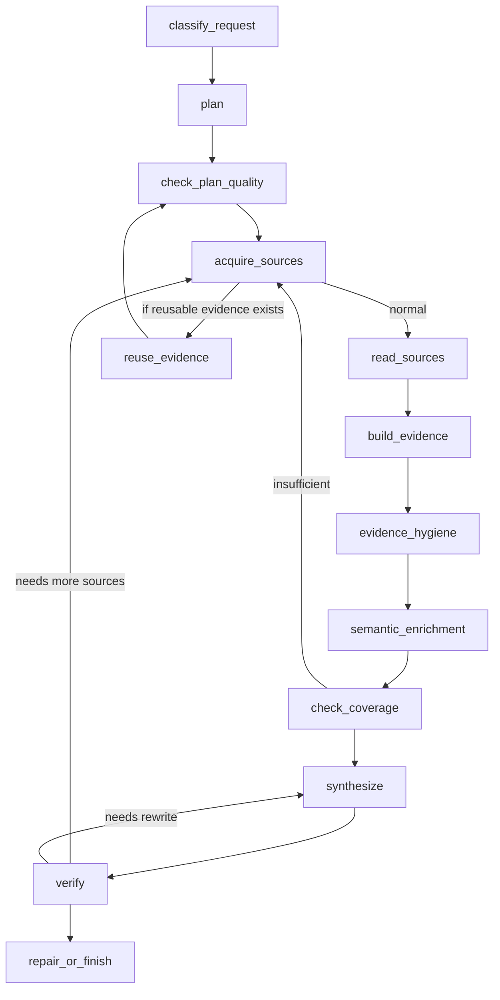

# Deep Research Pipeline: Stage-by-Stage Guide (Beginner-Friendly)

This document gives a zero-ambiguity walkthrough of the research agent execution graph.  
It is written for someone new to the codebase who may not know terms like *branch*, *coverage*, or *repair loop*.

Unless noted, code paths below refer to the repository root:

- `C:/Users/Hp/Documents/Codex/deep research/deep-research-agent`

---

## 1) High-Level View

One call to the CLI creates one isolated **run**:

- CLI entry: `python -m deep_research "question"`
- Main orchestrator: `deep_research/agent.py -> run_research()`
- Workflow is executed as a **stateful graph** from `deep_research/research_graph.py`
- Output lives in `runs/<run_id>/...` and is managed by `deep_research/artifacts_v2.py`

Think of the graph as a production line:
1. Classify the incoming question
2. Build and validate a plan
3. Fetch sources
4. Read and normalize source content
5. Build evidence from that content
6. Clean and score evidence
7. Test whether topic coverage is enough
8. Synthesize the report
9. Verify quality/citations
10. Repair or finish based on verification outcome

The graph is deterministic in structure, but each stage can branch and loop based on quality signals.

---

## 2) Big Terms for Newcomers

### What is a **run**?
A run is a single execution context with its own directory, metadata, metrics, source cache, findings, report, and logs.

### What is a **branch**?
In planning, a branch is one research direction/path the agent tries to answer a part of the question.

- Example: for “Compare SQL and NoSQL database choices…”, branches might be:
  - Branch 1: performance
  - Branch 2: consistency models
  - Branch 3: scaling costs
- Each branch gets one or more search queries.
- Branch coverage is measured so no single branch is starved.

### What is **coverage**?
Coverage measures how much of the planned branch work has evidence.
- Each branch gets an evidence score.
- Only when branches are sufficiently covered does synthesis proceed to final drafting.
- If coverage is weak, the graph can loop back to acquire more sources.

### What is a **source**?
- **Search candidate**: URL/result discovered during search.
- **Usable source**: Passed content/quality checks and produced extractable text.
- **Unusable source**: Rejected (blocked, too little content, inaccessible, duplicate, etc.) and excluded from citations.

### What is a **verification failure**?
Anything that blocks finalization:
- Missing/invalid citations
- Weakly supported claims
- Paragraphs without source support
- Coverage or quality thresholds failing
- Or repair attempts exceeding configured limits

---

## 3) Main Per-Run Artifacts (where data lives)

Files typically generated under a run folder:

- `run_manifest.json`
  - Reproducibility manifest with resolved settings, run metadata, dependency and runtime context
- `activity.jsonl`
  - Event stream for each stage/tool call
- `activity.md`
  - Human-readable timeline
- `activity.html`
  - UI-style activity view
- `research_plan.md`
- `plan_quality.json`
  - Plan quality scores and reasons
- `sources.json` / source registries
  - Deduplicated candidates + provenance
- `findings/`
  - Raw extraction + evidence traces by source
- `evidence_cards.json`
  - Structured evidence objects from sources
- `hygiene_report.json`
  - Dedup + low-quality filtering report
- `coverage_matrix.csv` and `coverage_report.json`
  - Branch-vs-evidence coverage map and score
- `report.md`
  - Draft/final report content
- `verification.json`
  - Citation/coverage/prose checks and weak-claim list
- `repair_checklist.md`
  - Deterministic repair recommendations
- `failure.json`
  - Hard failure classification (quota, token budget, tool failures, permission issues)
- `metrics.json`
  - Token usage, stage durations, routing decisions, retry counts

---

## 4) Stage-by-Stage Map (12 Nodes)

Below are all graph nodes in execution order.

### 1) `classify_request`
- **Purpose**
  - Normalize and classify the original user query.
  - Captures intent, language, and operational context.
- **Typical outputs**
  - Structured classification fields added to run state (query language, detected intent, etc.).
- **Why it matters**
  - Downstream steps use these fields for prompt templates, search strategy, and policy choices.
- **Important behavior**
  - Acts as the first guardrail so later LLM calls use consistent defaults.

### 2) `plan`
- **Purpose**
  - Create the first full research plan.
  - Includes:
    - branch planning
    - semantic enrichment
    - self-reflection critique of the raw plan
    - writer persona inference
- **Core idea**
  - This step tries to ensure the plan is sufficiently diverse (across branches) before sourcing starts.
- **Writes**
  - `research_plan.md` (and equivalent structured state)
  - Branch query list used by acquisition
- **Failure behavior**
  - If plan is malformed, weakly scoped, or too narrow, quality check below catches it.

### 3) `check_plan_quality`
- **Purpose**
  - Score and gate the plan before expensive sourcing.
- **Checks**
  - Branch similarity (to avoid duplicate research directions)
  - Term coverage and balance across branches
  - Generic criteria (scope, specificity, evidenceability)
- **Output**
  - `plan_quality.json`
  - A quality score used only as a pass/fail routing signal
- **Failure behavior**
  - Low-quality plans may be corrected by re-running planning/reflection before acquiring many sources.

### 4) `acquire_sources`
- **Purpose**
  - Search, scrape, recover, and register sources across all planned branches.
- **Tools used**
  - `collect_sources` (preferred default path for broad branch coverage)
  - `web_search` and `deep_scrape` for targeted recovery/follow-up
- **Important properties and features**
  - Deduplicates by URL and normalizes source provenance.
  - Tracks success/blocked/low-content reasons.
  - Stores both accepted and rejected source candidates.
  - Applies quality filters and branch coverage pressure.
- **Routing behavior**
  - May go directly to `read_sources` when there are fresh sources.
  - May route to `reuse_evidence` when prior acceptable evidence artifacts are already present.

### 5) `read_sources`
- **Purpose**
  - Convert collected sources into structured text payloads for evidence extraction.
- **What happens**
  - Loads usable source blobs and strips noisy content.
  - Produces normalized sections/snippets for downstream processing.
- **Why this matters**
  - LLM evidence extraction is only as good as normalized, bounded inputs.

### 6) `build_evidence`
- **Purpose**
  - Generate evidence cards from source text.
- **Outputs**
  - Structured claim/quote records with source linkage.
- **Mechanism**
  - Analyst-like extraction prompts identify factual assertions, attribution, dates, named entities, and supporting context.

### 7) `evidence_hygiene`
- **Purpose**
 - Remove duplicates and low quality evidence before semantic filtering.
- **Checks**
  - Redundant claim collapse
  - Low-confidence claim rejection
  - Source quality sanity gates
- **Output**
  - Cleaned evidence set plus rejection metadata

### 8) `semantic_enrichment`
- **Purpose**
  - Semantically score each evidence card for branch relevance.
- **Output**
  - Relevance scores per evidence/branch pair
  - Updated coverage matrix candidate inputs
- **Why it matters**
  - Prevents single-branch overfitting and helps determine where evidence is missing.

### 9) `check_coverage`
- **Purpose**
  - Decide whether the current evidence is enough to synthesize a trustworthy answer.
- **Rules considered**
  - Current branch coverage distribution
  - Remaining unsearched branch queries
  - Search limits already consumed
  - Coverage rounds already attempted
- **Possible routes**
  - `synthesize` if coverage is acceptable
  - `acquire_sources` if evidence is insufficient and limits permit
  - `finish` if hard stops have been hit and further work is not allowed

### 10) `synthesize`
- **Purpose**
  - Build the report draft from evidence.
- **Process**
  - Create a blueprint/outline
  - Draft full argumentation with inline citation placement
  - Rewrite opening paragraph and apply quality polish
- **Failure-safe behavior**
  - Produces deterministic intermediate drafts and can rerun with narrower focus on failed claims.

### 11) `verify`
- **Purpose**
  - Deterministic + model-assisted validation of report quality.
- **Checks**
  - Citation format and source-id mapping
  - Whether supported claims match actual source content
  - Coverage compliance
  - Prose quality checks
- **Failure outputs**
  - Weakly supported claims
  - Missing/invalid citation list
  - Coverage drift indicators
- **Writes**
  - `verification.json`
  - `findings/verification_repair.md` when repair is needed

### 12) `repair_or_finish`
- **Purpose**
  - Final control point.
- **Decision**
  - If verification passed: persist final report, stop graph
  - If verification failed and rounds remain:
    - route to `synthesize` for claim/structure repair
    - or `acquire_sources` for source starvation failures
  - If max rounds exhausted:
    - write `Verification Notes` and finish with residual issues documented
- **Finalization**
  - Captures final metrics and run outcome.
  - Updates status for token budget and elapsed cost accounting.

---

## 5) Routing Rules in Plain Terms

### From `acquire_sources`
- The stage can send the graph to source reading OR to reuse path.
- The reuse path is used when usable evidence already exists for an earlier stage and expensive re-fetching can be skipped.

### From `check_coverage`
- If branch coverage is below threshold and source budget remains, the graph acquires more sources.
- If no more source budget remains, it can terminate with current context (depending on hard stop policy).
- If coverage is adequate, it proceeds to synthesis.

### From `verify`
- If verification passes → finish.
- If verification fails due to missing facts/evidence quality → repair by synthesis.
- If verification fails because sources are missing for unresolved claims → acquire more sources.
- If `max_rounds` is reached, verification notes are embedded and run ends.

---

## 6) Operational Constraints and Guardrails

- **Query/llm budget gating**
  - The graph is bounded by settings for query ceilings and retry/repair rounds.
  - Failures like quota exhaustion or provider throttling are written to `failure.json` and surfaced in status.
- **Provider/model fallback**
  - If primary route fails, fallback routes are recorded through model routing metadata and activity events.
  - Retry and fallback behavior is time-bound and capped.
- **Checkpoint/resume**
  - Interrupted runs can be resumed through saved checkpoint markers and recovery transitions.
  - Resume chooses stage-specific entry points rather than restarting from scratch.
- **No-citation rule**
  - Search-only candidates and unusable scrape outputs are explicitly excluded from citation use.

---

## 7) Data Contracts (What each stage should produce)

Use this as a practical checklist when reading or debugging a run:

- Plan stage has branch list and a plan file.
- Acquisition has candidate sources + accepted/rejected accounting.
- Source reading has bounded content + URL metadata.
- Evidence has cards with source references.
- Hygiene has filtered evidence and rejection reasons.
- Enrichment has branch-relevance scores.
- Coverage has per-branch score matrix.
- Synthesis has a claim-to-citation-aware report draft.
- Verification has strict pass/fail with recoverable failure buckets.
- Repair/finalize writes explicit final metrics and residual warnings.

---

## 8) Where to inspect if something looks wrong

- `activity.md` / `activity.jsonl` for stage-by-stage timeline and model fallback history.
- `run_manifest.json` for reproducibility and exact config.
- `verification.json` for weak claim reasons.
- `failure.json` for hard failures (quota/tool permissions/route limits).
- `plan_quality.json`, `coverage_report.json`, and `metrics.json` for diagnostics.
- `activity.html` for a readable timeline with event grouping.

---

## 9) Glossary of Terms

- **State**: shared in-memory and persisted context passed between nodes.
- **Tool**: allowed function callable by LLMs (`collect_sources`, `web_search`, `deep_scrape`, `read_file`, `write_file`, `python_repl`, `verify_report_file`).
- **Checkpoint**: serialized progress marker for resume.
- **Round**: one pass through a repair/verification/acquisition cycle.
- **Branch**: one planned research direction.
- **Evidence card**: one structured claim/fragment extracted from source.
- **Coverage matrix**: evidence-versus-branch scoring table.

---

## 10) Summary

This agent is intentionally designed as a closed-loop pipeline:
1. plan and validate
2. gather and filter evidence
3. score branch coverage
4. draft
5. verify
6. repair as needed
7. fail cleanly with explicit diagnostics if limits are exceeded

If you want, this can be turned into a matching “operator runbook” version with a shorter checklist-style sequence for on-call debugging.
